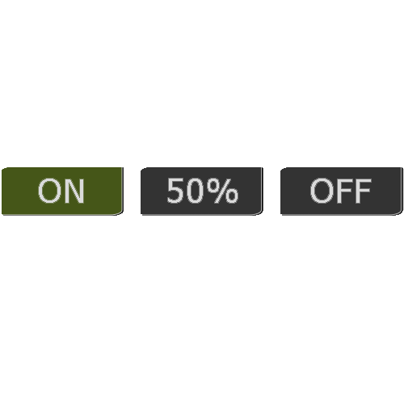
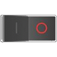

# ioBroker.vis-inventwo

[](https://www.npmjs.com/package/iobroker.vis-inventwo)

[](https://www.npmjs.com/package/iobroker.vis-inventwo)

[](https://david-dm.org/inventwo/iobroker.vis-inventwo)
[](https://snyk.io/test/github/inventwo/iobroker.vis-inventwo)
[](https://ci.appveyor.com/project/inventwo/iobroker-vis-inventwo)
[](https://github.com/inventwo/iobroker.vis-inventwo/LICENSE)

[](https://www.paypal.com/donate?hosted_button_id=7W6M3TFZ4W9LW)

[](https://nodei.co/npm/iobroker.vis-inventwo/)

## Widgets für den ioBroker.vis Adapter

Schalter, Slider, Tabellen, Regler, Checkboxen, Radiobuttons und mehr...<br>
Mit unserem Widgets-Set hast du die freie Wahl individuelle Visualisierungen ganz einfach für dein Smart-Home zu erstellen. 


Analog Uhren [Weitere Informationen](https://github.com/inventwo/ioBroker.vis-inventwo/wiki/Universal-%26-Multi-Widget-Inhaltstypen)


Digital Uhren [Weitere Informationen](https://github.com/inventwo/ioBroker.vis-inventwo/wiki/Universal-%26-Multi-Widget-Inhaltstypen)


###### .. ab v 2.0.0

<table>
   <tr>
        <td><center><b>Universal<br>&nbsp;</b><br></td>
        <td><center><b>Multi<br>&nbsp;</b><br></td>
        <td><center><b>Image<br>&nbsp;</b><br></td>
         <td><center><b>Table<br>&nbsp;</b><br></td>
    </tr>
<tr><td colspan=4></td></tr>   
    <tr>
        <td><center><b>List<br>&nbsp;</b><br></td>
        <td><center><b>Marquee<br>&nbsp;</b><br></td>
        <td><center><b>Radio Button<br>&nbsp;</b><br></td>
        <td><center><b>Slider<br>vertical</b><br></td>
    </tr>
<tr><td colspan=4></td></tr>   
      <tr>
        <td><center><b>Slider<br>horizontal</b><br></td>
        <td><center><b>Colorslider<br>horizontal</b><br></td>
        <td><center><b>Colorslider<br>horizontal</b><br></td>
        <td><center><b>Toggle Switch<br>&nbsp;</b><br></td>
    </tr>
<tr><td colspan=4></td></tr>   
      <tr>
        <td><center><b>Basic Switch<br>&nbsp;</b><br></td>
        <td><center><b>Checkbox/<br>Radiobutton</b><br></td>
    </tr>
</table>


Mit Hilfe unserer Widgets lassen sich folgende Projekte verwirklichen. Zur Zeit befinden sich in unserem Adapter NUR die reinen Schaltflächen (siehe oben). Uhr und Wetter stammen aus anderen Adaptern und müssen ggf. zusätzlich installiert werden.


---

## Unterstützung

Falls Dir unsere Arbeit gefällt und Du uns unterstützen möchtest, wir freuen uns über jede Spende.

(Dieser Link führt zu unserem PayPal-Konto und steht in keiner Verbindung zum ioBroker)

[](https://www.paypal.com/donate?hosted_button_id=7W6M3TFZ4W9LW)

---

## Changelog / Änderungsprotokoll

## 3.2.6 
- JSON-Tabelle: Hintergrund pro Zeile in Abhängigkeit eines Wertes färben [#280](https://github.com/inventwo/ioBroker.vis-inventwo/issues/280)
- JSON-Tabelle: Standardsortierung einer Spalte [#286](https://github.com/inventwo/ioBroker.vis-inventwo/issues/286)
- Universal- & Multi-Widget ViewInPopUp: Scrollen der View möglich [#344](https://github.com/inventwo/ioBroker.vis-inventwo/issues/344)
- Universal- & Multi-Widget HTTP: Link kann im gleichem oder neuem Tab geöffnet werden [#363](https://github.com/inventwo/ioBroker.vis-inventwo/issues/363)

- FIXED: JSON-Tabelle funktioniert nun auch wenn nur ein einzelnes Objekt statt Array mit Objekten im Datenpunkt steht [#319](https://github.com/inventwo/ioBroker.vis-inventwo/issues/319)
- FIXED: JSON-Tabelle: 10-stelliger Zeitstempel funktionierte nicht [#376](https://github.com/inventwo/ioBroker.vis-inventwo/issues/376)

## 3.2.5
- Bugfix

## 3.1.0
- Neues Widget: Basisschalter
- Neues Widget: Checkbox/Radiobutton
- Bugfixes

## 3.0.0
```diff
#### ACHTUNG ####
Nach dem Update sind die Icons vom Universal- und Multiwidget 
nicht zu sehen, sind aber nicht weg! Damit diese wieder zu sehen sind müssen 
die Widgets einmal EINZELN im Editor angeklickt werden.
```
- Beim Universal- und Multiwidget kann der Inhaltstyp geändert werden.
    - Inhaltstypen: Bild (Standard), Analoge Uhr, Digitale Uhr und HTML/Text 
    - Analoge und digitale Uhr: Farbe des Ziffernblatts under Zeiger kann frei gewählt werden, Zeitzone kann geändert werden
    - Statt dem Icon kann ein eigener Text oder ein Datenpunktwert per Binding angezeigt werden
- Vergleichsoperatoren Größer-Gelich und Kleiner-Gleich
- PopUp kann per Datenpunk geöffnet werden
- Bugfix:
    - Colorslider unsichtbar wenn für CIE kein Wert vorhanden ist
    - Links funktionieren nicht im Popup
    - State Rückmeldedauer funktioniert nicht richtig

## 2.9.7
- Bugfix

## 2.0.0
- Switch, Button, Nav und Background Widget (sowie die kleinen Ausführungen) zu einem einzigen Widget zussammengeführt -> dem Universal Widget 
- Multi Widget -> wie das Universal, nur dass hier auf mehrere Datenpunkte und Werte geprüft werden kann (Ähnlich der Signalbild Funktion)
- Image Widget kann nun auf Datenpunkt prüfen
- Radiobuttons hinzugefügt
- Werteliste hinzugefügt (Kann Liste aus einem Datenpunkt oder manuell eingetragenem Text erstellen)

## 1.3.8
- Changed slider step to decimal
- Fixed problem with numeric values

### 0.1.0 (Erstveröffentlichung)
- inventwo Design Widgets

## License

Urheberrechte (c) 2021 [jkvarel](https://github.com/jkvarel) und [skvarel](https://github.com/skvarel) von [inventwo](https://github.com/inventwo)


MIT License (nur in englisch / englisch only)

Permission is hereby granted, free of charge, to any person obtaining a copy
of this software and associated documentation files (the "Software"), to deal
in the Software without restriction, including without limitation the rights
to use, copy, modify, merge, publish, distribute, sublicense, and/or sell
copies of the Software, and to permit persons to whom the Software is
furnished to do so, subject to the following conditions:

The above copyright notice and this permission notice shall be included in all
copies or substantial portions of the Software.

THE SOFTWARE IS PROVIDED "AS IS", WITHOUT WARRANTY OF ANY KIND, EXPRESS OR
IMPLIED, INCLUDING BUT NOT LIMITED TO THE WARRANTIES OF MERCHANTABILITY,
FITNESS FOR A PARTICULAR PURPOSE AND NONINFRINGEMENT. IN NO EVENT SHALL THE
AUTHORS OR COPYRIGHT HOLDERS BE LIABLE FOR ANY CLAIM, DAMAGES OR OTHER
LIABILITY, WHETHER IN AN ACTION OF CONTRACT, TORT OR OTHERWISE, ARISING FROM,
OUT OF OR IN CONNECTION WITH THE SOFTWARE OR THE USE OR OTHER DEALINGS IN THE
SOFTWARE.

---

Icons from Icons8 https://icons8.com/
