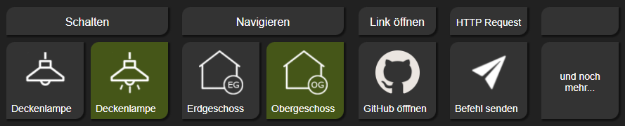
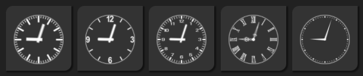
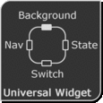
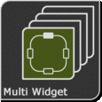
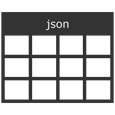
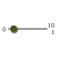
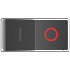
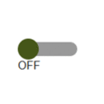
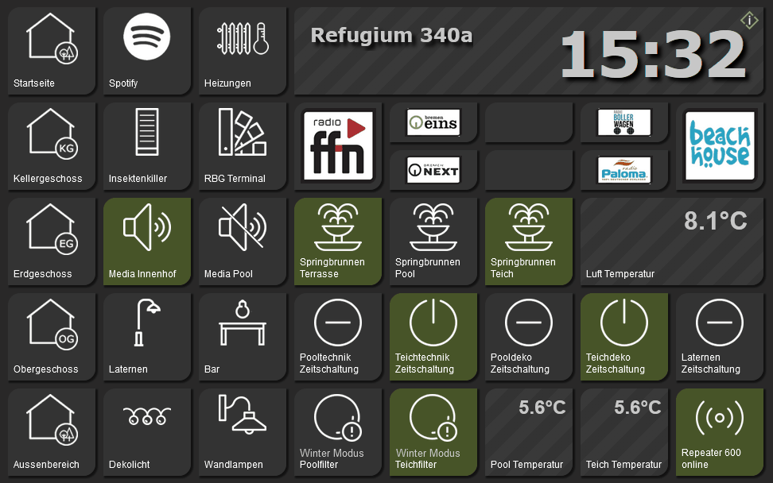

# ioBroker.vis-inventwo

 

## Widgets für den ioBroker.vis Adapter

Schalter, Slider, Tabellen, Regler, Checkboxen, Radiobuttons und mehr... 
Mit unserem Widgets-Set hast du die freie Wahl individuelle Visualisierungen ganz einfach für dein Smart-Home zu erstellen. 

### Wichtiger Hinweis für Vis 2
Der Adapter ist für VIS 1 entwickelt und getestet. In Vis 2 können Fehler auftreten die die Nutzung deiner Visualisierung nicht ermöglichen. 
Eine nahtlose Kompatibilität wird nicht möglich sein. Ein neuer Adapter für Vis 2 findest du hier: https://github.com/inventwo/ioBroker.vis-2-widgets-inventwo

## Inhalt des Adapters

Verschiedene Widgets zum schalten, navigieren und mehr.

Analog Uhren [Weitere Informationen](https://github.com/inventwo/ioBroker.vis-inventwo/wiki/Universal-%26-Multi-Widget-Inhaltstypen)

Digital Uhren [Weitere Informationen](https://github.com/inventwo/ioBroker.vis-inventwo/wiki/Universal-%26-Multi-Widget-Inhaltstypen)

Colorpicker [Weitere Informationen](https://github.com/inventwo/ioBroker.vis-inventwo/wiki/Colorpicker)

Für mehr Infos schaue dich im [Wiki](https://github.com/inventwo/ioBroker.vis-inventwo/wiki) um.

###### Alle Widgets ab Version 2.0.0

<table>
   <tr>
        <td>
<b>Universal &nbsp;</b> </td>
        <td>
<b>Multi &nbsp;</b> </td>
        <td>
<b>Image &nbsp;</b> </td>
         <td>
<b>Table &nbsp;</b> </td>
    </tr>
<tr><td colspan=4></td></tr>   
    <tr>
        <td>
<b>List &nbsp;</b> </td>
        <td>
<b>Marquee &nbsp;</b> </td>
        <td>
<b>Radio Button &nbsp;</b> </td>
        <td>
<b>Slider vertical</b> </td>
    </tr>
<tr><td colspan=4></td></tr>   
      <tr>
        <td>
<b>Slider horizontal</b> </td>
        <td>
<b>Colorslider horizontal</b> </td>
        <td>
<b>Colorslider horizontal</b> </td>
        <td>
<b>Toggle Switch &nbsp;</b> </td>
    </tr>
<tr><td colspan=4></td></tr>   
      <tr>
        <td>
<b>Basic Switch &nbsp;</b> </td>
        <td>
<b>Checkbox/ Radiobutton</b> </td>
        <td>
<b>Colorpicker &nbsp;</b> </td>
    </tr>
</table>

Mit Hilfe unserer Widgets lassen sich folgende Projekte verwirklichen. Zur Zeit befinden sich in unserem Adapter NUR die reinen Schaltflächen (siehe oben). Uhr und Wetter stammen aus anderen Adaptern und müssen ggf. zusätzlich installiert werden.

---

## Unterstützung

Falls Dir unsere Arbeit gefällt und Du uns unterstützen möchtest, wir freuen uns über jede Spende.

(Dieser Link führt zu unserem PayPal-Konto und steht in keiner Verbindung zum ioBroker)

---

## Changelog

### **WORK IN PROGRESS**
- (iobroker-bot) Adapter requires node.js >= 20 now.

<!--
  Placeholder for the next version (at the beginning of the line):
  ### **WORK IN PROGRESS**
-->

### 3.3.5
- Fixed: [#688](https://github.com/inventwo/ioBroker.vis-inventwo/issues/688) Radiobutton kann kein boolean schreiben
- Fixed: [#736](https://github.com/inventwo/ioBroker.vis-inventwo/issues/736) Fehler vom Adapter Checker in package.json und io-package.json behoben
- Fixed: [#678](https://github.com/inventwo/ioBroker.vis-inventwo/issues/678) mode in io-package von daemon auf once umgestellt

### 3.3.4
- Fixed: [#455](https://github.com/inventwo/ioBroker.vis-inventwo/issues/455) Color-Picker-Widget "verschwindet" bei Auswahl von CIE
- Fixed: [#369](https://github.com/inventwo/ioBroker.vis-inventwo/issues/369) Simple Slider Farbe der Schritte nicht änderbar
- Fixed: [#361](https://github.com/inventwo/ioBroker.vis-inventwo/issues/361) Image Widget zeigt immer das Image für true
- Fixed: [#564](https://github.com/inventwo/ioBroker.vis-inventwo/issues/564) Radiobutton - Bildfarbe true wird von false übernommen
- Fixed: [#461](https://github.com/inventwo/ioBroker.vis-inventwo/issues/461) Doppelauslösung Taster/state und "slider lässt sich nicht "sliden bei Windows Touch
- Fixed: [#474](https://github.com/inventwo/ioBroker.vis-inventwo/issues/474) json Tabelle mit "Binding"
- Fixed: [#580](https://github.com/inventwo/ioBroker.vis-inventwo/issues/580) JSON Table Widget: Farbänderung der Werte via Schwellwert ist nur im Editor, nicht in Runtime sichtbar.
- Fixed: [#622](https://github.com/inventwo/ioBroker.vis-inventwo/issues/622) Think about to fix the issues found by adapter checker

### 3.3.3
- Problem mit Umrandungsfarbe beim Multi-Widget View in PopUp behoben

### 3.3.2
- Bugfix

### 3.3.1
- Bugfix

---

## License

MIT License (nur in englisch / englisch only)

Permission is hereby granted, free of charge, to any person obtaining a copy
of this software and associated documentation files (the "Software"), to deal
in the Software without restriction, including without limitation the rights
to use, copy, modify, merge, publish, distribute, sublicense, and/or sell
copies of the Software, and to permit persons to whom the Software is
furnished to do so, subject to the following conditions:

The above copyright notice and this permission notice shall be included in all
copies or substantial portions of the Software.

THE SOFTWARE IS PROVIDED "AS IS", WITHOUT WARRANTY OF ANY KIND, EXPRESS OR
IMPLIED, INCLUDING BUT NOT LIMITED TO THE WARRANTIES OF MERCHANTABILITY,
FITNESS FOR A PARTICULAR PURPOSE AND NONINFRINGEMENT. IN NO EVENT SHALL THE
AUTHORS OR COPYRIGHT HOLDERS BE LIABLE FOR ANY CLAIM, DAMAGES OR OTHER
LIABILITY, WHETHER IN AN ACTION OF CONTRACT, TORT OR OTHERWISE, ARISING FROM,
OUT OF OR IN CONNECTION WITH THE SOFTWARE OR THE USE OR OTHER DEALINGS IN THE
SOFTWARE.

---

Icons from Icons8 https://icons8.com/

Copyright (c) 2025-2026 [jkvarel](https://github.com/jkvarel) und [skvarel](https://github.com/skvarel) von [inventwo](https://github.com/inventwo)

